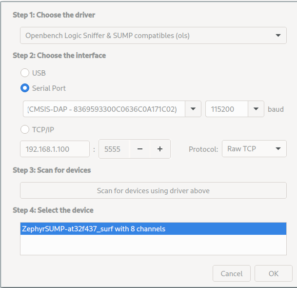

# Zephyr SUMP

> This Project implement [sump](https://sigrok.org/wiki/SUMP_compatibles) protocol based on [zephyr](https://www.zephyrproject.org/) RTOS.

## UNDER DEVELOPING

> this project is unnder developing.

- [TODO LIST](https://github.com/feilongfl/ZephyrSUMP/issues/1)

## Manual

- install zephyr development envrioment.
- into zephyr source, set remote to `https://github.com/feilongfl/ZephyrSUMP.git`, and checkout main branch.
- update west packages
  ``` shell
  west update
  ```

- compile
    ```
    west build -p always -b at_surf_f437 app
    west flash
    ```

- open [pulseview](https://sigrok.org/wiki/PulseView), and select your device

  

- enjoy!

  

