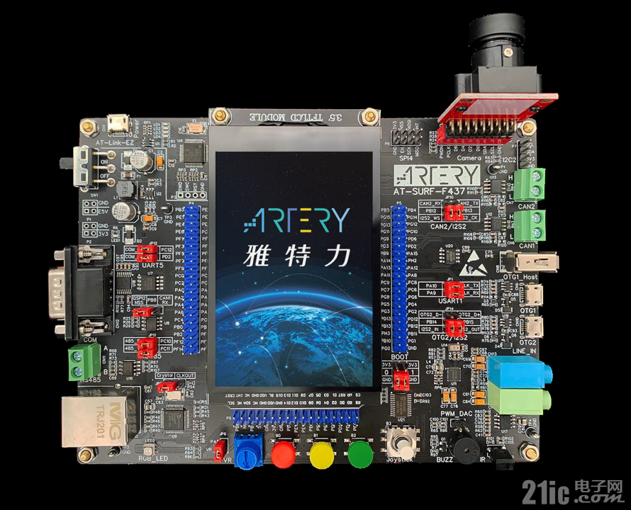

.. _at_surf_f437:

Artery AT32_SURF_F437
#########################

Overview
********

The AT32_SURF_F437 board is a hardware platform that enables design and debug
of the Artery F437 Cortex-M4F High Performance MCU.

The AT32F437ZMT7 features a single-core ARM Cortex-M4F MCU which can run up
to 288-MHz with flash accesses zero wait states, 256kiB of Flash, 384kiB of
SRAM and 142 GPIOs.

Hardware
********

- USB interface with 2 micro-USB connector and 1 USB-A connector
- 1 user RGB-LED
- 2 user push buttons
- Joystick with 4-direction control and selector
- Reset Button
- ADC connected to a potentiometer
- W25Q128JVSQ 16Mib SPI Flash
- K24C02 2KiB EEPROM
- LY68L6400S 8Mib PSRAM
- W9825G6KH-6 32M SDRAM
- 3.5 TFT LCD (320x480)
- AT-Link interface

  - CMSIS-DAP swd debug interface over USB HID.

- 2 CAN port(support CAN-FD)

For more information about the GD32E103 SoC and AT32_SURF_F437 board:

- `AT32F437 Cortex-M4F High Performance SoC Website`_
- `AT32F43x Datasheet`_
- `AT32F43x Reference Manual`_
- `AT_SURF_F437 Schematics/PCB/Documents`_
- `AT32 ISP Console`_

Supported Features
==================

The board configuration supports the following hardware features:

.. list-table::
   :header-rows: 1

   * - Peripheral
     - Kconfig option
     - Devicetree compatible
   * - NVIC
     - N/A
     - :dtcompatible:`arm,v7m-nvic`
   * - SYSTICK
     - N/A
     - N/A
   * - USART
     - :kconfig:option:`CONFIG_SERIAL`
     - :dtcompatible:`artery,at32-usart`

Serial Port
===========

The AT32_SURF_F437 board has 3 serial communication ports. The default port
is UsART1 at PIN-A9 and PIN-A10.

Programming and Debugging
*************************

Before program your board make sure to configure boot setting and serial port.
The default serial port is USART0.  This port uses header JP-5/6 to route
signals between USB VBUS/ID and USART J2.

+--------+--------+------------+
| Boot-0 | Boot-1 | Function   |
+========+========+============+
|  1-2   |  1-2   | SRAM       |
+--------+--------+------------+
|  1-2   |  2-3   | Bootloader |
+--------+--------+------------+
|  2-3   |  Any   | Flash      |
+--------+--------+------------+

+------+------+-------------+
| JP-5 | JP-6 | Function    |
+======+======+=============+
| 1-2  | 1-2  | USART0 / J2 |
+------+------+-------------+
| 2-3  | 2-3  | USB VBUS/ID |
+------+------+-------------+
| open | open | Free        |
+------+------+-------------+

Using AT-Link
=============

The AT32_SURF_F437 includes an onboard programmer/debugger (GD-Link) which
allow flash programming and debug over USB. There are also program and debug
headers J1 and J100 that can be used with any ARM compatible tools.

#. Build the Zephyr kernel and the :ref:`hello_world` sample application:

   .. zephyr-app-commands::
      :zephyr-app: samples/hello_world
      :board: at_surt_f437
      :goals: build
      :gen-args: -DOPENOCD=<path/to/artery-openocd/bin/openocd> -DOPENOCD_DEFAULT_PATH=<path/to/artery-openocd/share/openocd/scripts>
      :compact:

#. Run your favorite terminal program to listen for output. Under Linux the
   terminal should be :code:`/dev/ttyUSB0`. For example:

   .. code-block:: console

      $ minicom -D /dev/ttyUSB0 -o

   The -o option tells minicom not to send the modem initialization
   string. Connection should be configured as follows:

      - Speed: 115200
      - Data: 8 bits
      - Parity: None
      - Stop bits: 1

#. To flash an image:

   .. zephyr-app-commands::
      :zephyr-app: samples/hello_world
      :board: at_surt_f437
      :goals: flash
      :compact:

   You should see "Hello World! at_surt_f437" in your terminal.

#. To debug an image:

   .. zephyr-app-commands::
      :zephyr-app: samples/hello_world
      :board: at_surt_f437
      :goals: debug
      :compact:

Using ROM bootloader
====================

The GD32E103 MCU have a ROM bootloader which allow flash programming.  User
should install `GD32 ISP Console`_ software at some Linux path.  The recommended
is :code:`$HOME/.local/bin`.

#. Build the Zephyr kernel and the :ref:`hello_world` sample application:

   .. zephyr-app-commands::
      :zephyr-app: samples/hello_world
      :board: at_surt_f437
      :goals: build
      :compact:

#. Enable board bootloader:

   - Remove boot-0 jumper
   - press reset button

#. To flash an image:

   .. code-block:: console

      west build -b at_surt_f437 samples/hello_world
      west flash -r at32isp [--port=/dev/ttyUSB0]

#. Run your favorite terminal program to listen for output. Under Linux the
   terminal should be :code:`/dev/ttyUSB0`. For example:

   .. code-block:: console

      $ minicom -D /dev/ttyUSB0 -o

   The -o option tells minicom not to send the modem initialization
   string. Connection should be configured as follows:

      - Speed: 115200
      - Data: 8 bits
      - Parity: None
      - Stop bits: 1

   Press reset button

   You should see "Hello World! at_surt_f437" in your terminal.

.. _AT32F437 Cortex-M4F High Performance SoC Website:
	https://www.arterytek.com/en/product/AT32F437.jsp

.. _AT32F43x Datasheet:
	https://www.arterytek.com/download/DS/DS_AT32F435_437_V2.01_EN.pdf

.. _AT32F43x Reference Manual:
	https://www.arterytek.com/download/RM/RM_AT32F435_437_EN_V2.01.pdf

.. _AT_SURF_F437 Schematics/PCB/Documents:
	https://www.arterytek.com/download/AT-START/AT_SURF_F437_V1.1.zip

.. _AT32 ISP Console:
	https://www.arterytek.com/download/TOOL/Artery_ISP_Programmer_V2.0.03.zip
